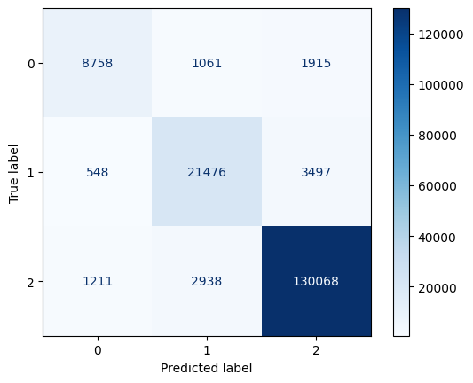

# Lithology Classification from Well Logs using XGBoost

## Project Overview

This petroleum engineering project applies supervised machine learning to classify **lithology** from **well log** data using the **XGBoost** algorithm. The model predicts three lithology classes — **Sandstone, Shale, and Limestone** — from petrophysical well log measurements, supporting faster and more consistent geological interpretation.

Lithology interpretation can be subjective and time-consuming. This project aims to **assist** engineers by providing fast, consistent lithology predictions, helping reduce interpretation variability rather than replacing expert judgment.


## Project Structure

```text
├── data/                     # Raw and processed well log datasets
│   ├── raw/
│   │   └── README.md
│   └── processed/
│       └── .gitkeep
│
├── images/                   # Figures and visualizations used in the README
│   ├── ConfusionMatrix.png
│   └── Feature importance.png
│
├── models/                   # Trained machine learning models
│   ├── ClassificationModel.pkl
│   └── label_encoder.pkl
│
├── notebooks/                # Jupyter notebooks for EDA, model development, and experiments
│   └── Lithology_Classification_from_Well_Logs_using_XGBoost.ipynb
│
├── reports/                  # Model evaluation results
│   ├── classification_report.txt
│   └── cross_validation_results.txt
│
├── src/                      # Source code for the machine learning pipeline
│   ├── data_loader.py
│   ├── preprocessing.py
│   ├── train.py
│   ├── evaluate.py
│   ├── predict.py
│   ├── visualization.py
│   └── .gitkeep
│
├── README.md                 # Project documentation
└── requirements.txt          # Python dependencies
```

## Well Log Data

The dataset is based on the **FORCE 2020** well-log dataset. The core petrophysical logs used include:

- **Gamma Ray (GR):** Measures natural radioactivity and helps distinguish shale from clean formations.
- **Bulk Density (RHOB):** Estimates rock density and is useful for identifying lithology and porosity.
- **Neutron Porosity (NPHI):** Estimates formation porosity based on hydrogen content.
- **Photoelectric Factor (PEF):** Helps differentiate mineral compositions and lithology (used when available).
- **Compressional Sonic (DTC):** Measures acoustic travel time and provides information about rock properties.
- **Caliper (CALI)** and **Deep Resistivity (RDEP):** Used alongside the logs above as the required "core suite" — rows missing any of these are excluded.


## Results

| Metric | Score |
|--------|------:|
| Accuracy | 0.93 |
| Macro F1-Score | 0.86 |


**confusion_matrix**

| Class ID | Lithology |
|:--------:|-----------|
| 0 | Limestone |
| 1 | Sandstone |
| 2 | Shale |



**feature_importance**


## Workflow

```text
Well Log Data
      │
      ▼
Quick Data Exploration
      │
      ▼
Train/Test Split (by well)
      │
      ├─────────────────────────────┐
      │                             │
      ▼                             ▼
Training Set                  Testing Set
      │                             │
      ▼                             │
Data Cleaning                       │
      │                             │
      ▼                             │
Feature Engineering                 │
      │                             │
      ▼                             │
XGBoost Model Training              │
      │                             │
      ▼                             │
Group Cross-Validation              │
      │                             │
      └──────────────┐              │
                      ▼              ▼
              Final Model Evaluation
                      │
                      ▼
             Feature Importance
```

## How to Run

```bash
git clone https://github.com/mohammedbaqir01/Lithology-Classification-from-Well-Logs-using-XGBoost-Model.git
cd Lithology-Classification-from-Well-Logs-using-XGBoost-Model
pip install -r requirements.txt
```

> **Note:** The notebook was developed in Google Colab and currently loads data by mounting Google Drive (`drive.mount(...)`) from a fixed Drive path. To run it locally, replace the Drive-mounting cell with a direct read from `data/raw/`, then run the notebook top to bottom in Jupyter or Colab.

## 🛡️ License
Project is distributed under MIT License

## Author

**Mohammed Baqer Ahmed**

Petroleum Engineering graduate with a focus on Machine Learning applications in the oil and gas industry.

- 📧 **Email:** <mohammedbaqir010@gmail.com>
- 💼 **LinkedIn:** https://www.linkedin.com/in/mohammed-baqer-ahmed-079098280
- 🐙 **GitHub:** https://github.com/mohammedbaqir01
