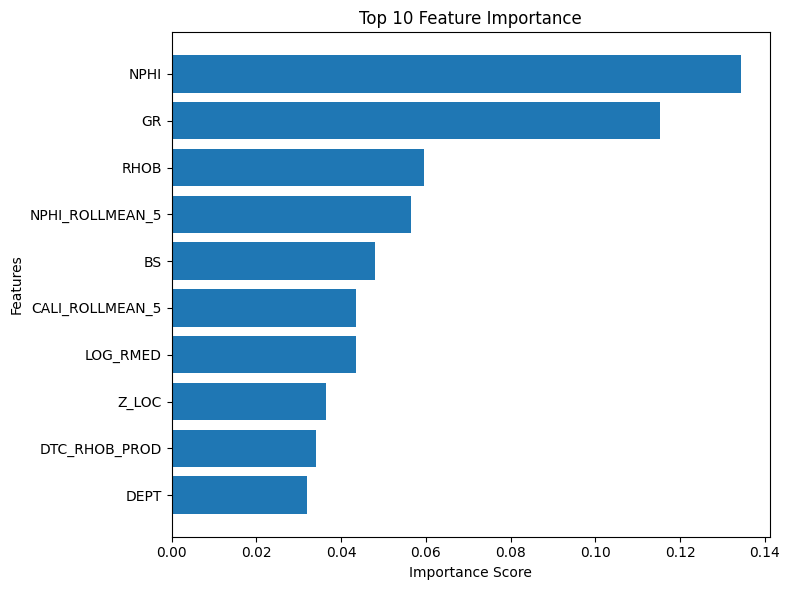

# Lithology Classification from Well Logs using XGBoost

## Project Overview

This petroleum engineering project applies supervised machine learning to classify **lithology** from **well log** data using the **XGBoost** algorithm. The model predicts three lithology classes — **Sandstone, Shale, and Limestone** — from petrophysical well log measurements, supporting faster and more consistent geological interpretation.

Lithology interpretation can be subjective and time-consuming. This project aims to **assist** engineers by providing fast, consistent lithology predictions, helping reduce interpretation variability rather than replacing expert judgment.

## Project Structure

```text
├── data/                         # Raw and processed well log datasets
│   ├── raw/
│   │   └── README.md
│   └── processed/
│       └── .gitkeep
│
├── figures/                      # Figures and visualizations used in the README
│   ├── confusion_matrix.png
│   └── feature_importance.png
│
├── models/                       # Trained machine learning artifacts
│   ├── ClassificationModel.pkl
│   └── label_encoder.pkl
│
├── notebooks/                    # Jupyter notebooks for EDA, development, and experiments
│   └── Lithology_Classification_from_Well_Logs_using_XGBoost.ipynb
│
├── reports/                      # Model evaluation results
│   ├── classification_report.txt
│   └── cross_validation_results.txt
│
├── src/                          # Main source-code package
│   ├── data/                     # Data loading, cleaning, and splitting
│   ├── evaluation/               # Model evaluation and reporting
│   ├── features/                 # Feature engineering
│   ├── modeling/                 # Model training and cross-validation
│   ├── serving/                  # API serving code
│   ├── tests/                    # Project tests
│   ├── utils/                    # Utility functions
│   ├── main.py                   # FastAPI application
│   └── run_pipeline.py           # End-to-end ML pipeline entry point
│
├── .gitignore
├── Dockerfile
├── LICENSE
├── README.md
└── requirements.txt
```

## Well Log Data

The dataset is based on the **FORCE 2020** well-log dataset.

## Results

| Metric | Score |
|--------|------:|
| Accuracy | 0.93 |
| Macro F1-Score | 0.86 |

### Confusion Matrix

| Class ID | Lithology |
|:--------:|-----------|
| 0 | Limestone |
| 1 | Sandstone |
| 2 | Shale |


### Feature Importance



## Machine Learning Workflow

```text
Well Log Data
      │
      ▼
Quick Data Exploration
      │
      ▼
Train/Test Split (GroupKFold by well)
      │
      ├─────────────────────────────┐
      │                             │
      ▼                             ▼
Training Set                  Testing Set
      │                             │
      ▼                             │
Feature Engineering                 |
      │                             │
      ▼                             │
XGBoost Model Training              │                    
      │                             │
      ▼                             │
Group Cross-Validation              │
      │                             │
      └──────────────┐              │
                     ▼              ▼
             Final Model Evaluation
                     │
                     ▼
              Feature Importance
                     │
                     ▼
        Model Serialization (.pkl)
                     │
                     ▼
       API Deployment (FastAPI + Docker
        → Azure Container Instances)
```

## How to Run

Clone the repository and install the dependencies:

```bash
git clone https://github.com/mohammedbaqir01/Lithology-Classification-from-Well-Logs-using-XGBoost-Model.git
cd Lithology-Classification-from-Well-Logs-using-XGBoost-Model
pip install -r requirements.txt
```

### Run the ML Pipeline

The pipeline entry point is located inside `src/`.

Because the project uses imports such as `src.features...`, run it from the **project root** as a module:

```bash
python -m src.run_pipeline
```

### Run the API locally

The FastAPI application is defined in `src/main.py`.

Run it with Uvicorn:

```bash
python -m uvicorn src.main:app --reload
```

You can also run the module directly:

```bash
python -m src.main
```

> Run these commands from the project root directory, not from inside `src/`.

## 🛰️ Live API

A deployed machine learning service that predicts rock lithology from well log measurements, hosted live on Azure.

### Access

| | |
|---|---|
| **Swagger UI** | [lithologyapi.uaenorth.azurecontainer.io:8000/docs](http://lithologyapi.uaenorth.azurecontainer.io:8000/docs) |
| **Base URL** | `http://lithologyapi.uaenorth.azurecontainer.io:8000` |
| **Region** | Azure Container Instances — UAE North |

---

### Tech Stack

- **Model:** XGBoost (trained on FORCE 2020 lithology dataset)
- **Backend:** FastAPI
- **Containerization:** Docker
- **Hosting:** Azure Container Instances

---

### How to Test

1. Open the Swagger UI: http://lithologyapi.uaenorth.azurecontainer.io:8000/docs
2. Expand the prediction endpoint and select **Try it out**
3. Paste in one of the sample payloads below (each represents a different lithology)
4. Execute the request and review the predicted class against the expected label

> [!TIP]
> Each sample below is a real well-log record pulled from the FORCE 2020 test set, labeled with its true lithology so you can sanity-check the model's prediction.

---

### Sample Requests

<details>
<summary>🟡 well 26/4-1</summary>

```json
{
  "source_file": "Force_2020_all_wells_train_test_blind_hidden_final/26_4-1.las",
  "well_name": "26/4-1",
  "DEPT": 2810.7122,
  "FORCE_2020_LITHOFACIES_CONFIDENCE": 1.0,
  "FORCE_2020_LITHOFACIES_LITHOLOGY": 30000,
  "CALI": 8.27344,
  "RDEP": 0.89230,
  "RMED": 1.16342,
  "DTC": 88.09482,
  "NPHI": 0.23286,
  "PEF": 4.00485,
  "GR": 53.16555,
  "RHOB": 2.33559,
  "DRHO": -0.00697,
  "DEPTH_MD": 2810.7122,
  "X_LOC": 501132.3125,
  "Y_LOC": 6608172.0,
  "Z_LOC": -2787.4451,
  "BS": 8.5
}
```

</details>

<details>
<summary>🟤 well 34/5-1 A</summary>

```json
{
  "source_file": "Force_2020_all_wells_train_test_blind_hidden_final/34_5-1 A.las",
  "well_name": "34/5-1 A",
  "DEPT": 2560.5060,
  "FORCE_2020_LITHOFACIES_CONFIDENCE": 1.0,
  "FORCE_2020_LITHOFACIES_LITHOLOGY": 65000,
  "CALI": 12.12654,
  "RDEP": 1.38839,
  "RMED": 1.48019,
  "DTC": 111.31543,
  "NPHI": 0.35000,
  "PEF": 4.39317,
  "GR": 84.42467,
  "RHOB": 2.33314,
  "DRHO": 0.00255,
  "DEPTH_MD": 2560.5061,
  "X_LOC": 478842.875,
  "Y_LOC": 6845677.5,
  "Z_LOC": -2506.0632,
  "BS": 12.250001
}
```

</details>

<details>
<summary>⚪ well 25/10-9 Aegis</summary>

```json
{
  "source_file": "Force_2020_all_wells_train_test_blind_hidden_final/25_10-9.las",
  "well_name": "25/10-9 Aegis",
  "DEPT": 2408.1848,
  "FORCE_2020_LITHOFACIES_CONFIDENCE": 1.0,
  "FORCE_2020_LITHOFACIES_LITHOLOGY": 70000,
  "CALI": 12.02373,
  "RDEP": 3.25196,
  "RMED": 2.64917,
  "DTC": 74.95468,
  "NPHI": 0.14116,
  "PEF": 4.93655,
  "GR": 38.41137,
  "RHOB": 2.50727,
  "DRHO": 0.00162,
  "DEPTH_MD": 2408.1848,
  "X_LOC": 452404.3125,
  "Y_LOC": 6552707.0,
  "Z_LOC": -2382.6289,
  "BS": 12.250001
}
```

</details>

> note: FORCE_2020_LITHOFACIES_CONFIDENCE" and
  "FORCE_2020_LITHOFACIES_LITHOLOGY" will be deleted from the model


## License

Project is distributed under the MIT License.

## Author

**Mohammed Baqer Ahmed**

Petroleum Engineering graduate with a focus on Machine Learning applications in the oil and gas industry.

- 📧 **Email:** <mohammedbaqir010@gmail.com>
- 💼 **LinkedIn:** https://www.linkedin.com/in/mohammed-baqer-ahmed-079098280
- 🐙 **GitHub:** https://github.com/mohammedbaqir01
